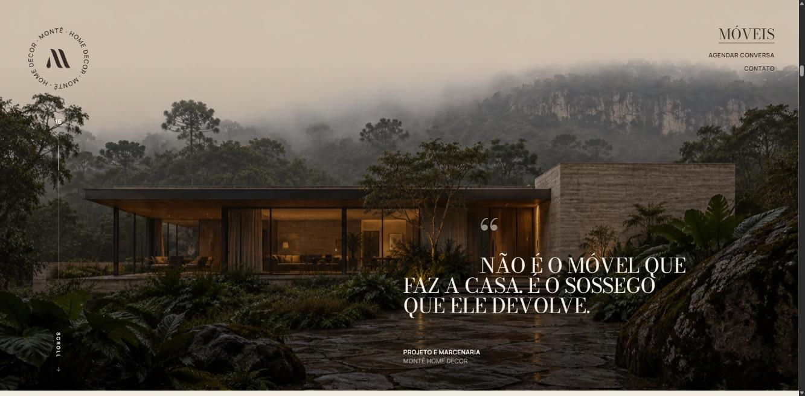
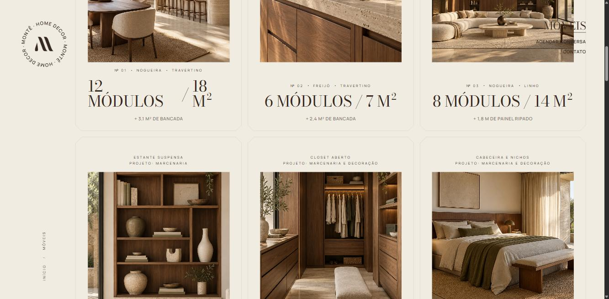
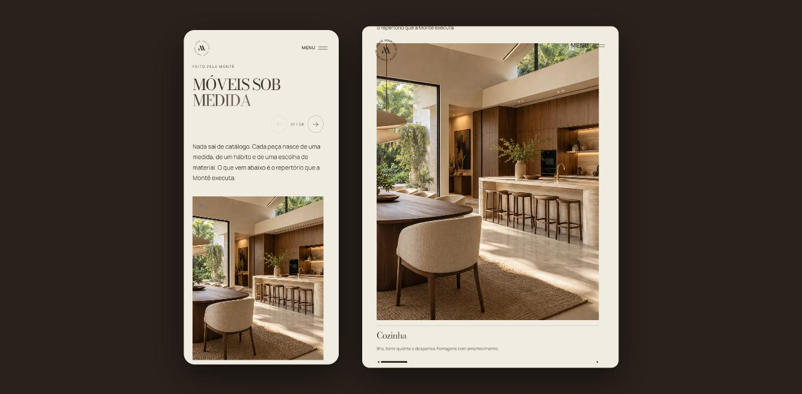

# Montê Home Decor

Authored website for a custom fitted furniture and interior decoration studio in
Osório, Rio Grande do Sul, Brazil. Plain HTML, CSS and JavaScript, no framework,
no build step, no package manager.

**Live: [montehomedecor.pages.dev](https://montehomedecor.pages.dev)**


## Stack

| | |
|--|--|
| Markup and styles | Hand written HTML and CSS, custom properties, no preprocessor |
| Motion | GSAP (ScrollTrigger, SplitText, CustomEase) and Lenis, loaded from CDN |
| Build | None. The folder is the artifact |
| Hosting | Cloudflare Pages, static upload |

## Structure

```
site/
├── index.html      home, 12 scroll driven sections
├── moveis.html     catalogue of executed pieces
├── moveis/         12 individual piece pages
├── style.css       layout, type scale, theme tokens
├── abertura.css    the opening sequence
├── moveis.css      catalogue and piece pages
├── motion.js       scroll choreography, the whole motion layer
├── app.js          carousels, menu, small interactions
└── moveis.js       catalogue behaviour
```

## What is in the code

- **Opening sequence.** A typed title card that runs once per browser session, remembered in `sessionStorage`, and never replays on internal navigation.
- **Scroll choreography.** Every section is a ScrollTrigger timeline: an arch mask that opens into the hero, word by word text reveals via SplitText, parallax pairs, a magnetic circular button, and two horizontal tracks driven by vertical scroll, one of them running over a silent looping video.
- **Carousels without a library.** Native CSS scroll snap for the motion, buttons only for affordance, disabled state and an `aria-live` counter derived from `scrollLeft`.
- **Theme switching on scroll.** Sections declare `data-bg`, and the fixed chrome (mark, menu, counters) inverts as each one crosses the viewport.
- **Motion has an off switch.** `prefers-reduced-motion` is honoured in all three stylesheets and in `motion.js`, which falls back to static reveals instead of timelines.

| | |
|--|--|
|  |  |

## Responsiveness

One breakpoint, 992px. Above it the layout is editorial, asymmetric and parallax
driven. Below it the same content stacks, parallax containers opt out through
`data-mob="off"`, and the horizontal tracks become vertical. Below is the same
section at 390px and at 768px.



## About this repository

The repository carries the code, not the media. Images, fonts and the video are
excluded on purpose, so the point here is reading the source and seeing the
result on the live site, not cloning the folder. The images shown in the site are
conceptual, awaiting photography of executed work.
